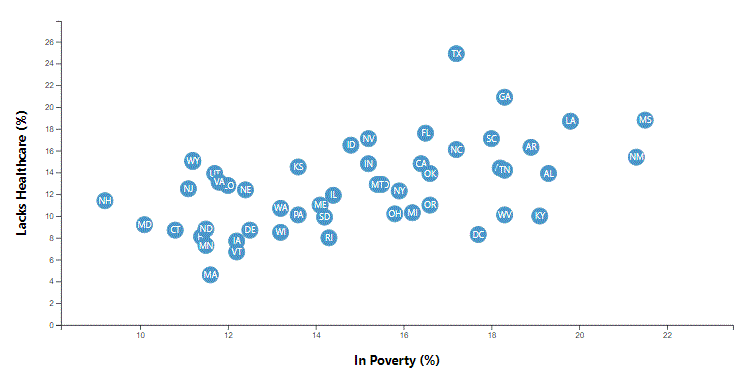

# D3-challenge
* This project creates a dynamically genrated scatter chart

## Programming Languages
* HTML - display platform
* CSS - formatting for display format
* JavaScript - allows for dynamic selection from multiple state samples
    * D3 - build and place individual elements of the chart dynamically

## Data
* The data comes from a .csv file

## Visualizations
* Scatter Plot - displays the relationship between those in poverty vs. those lacking healthcare for each state in the US.

    
