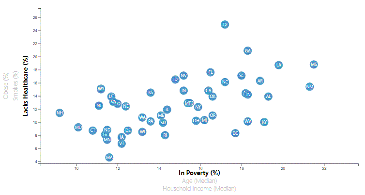

# Dynamic Scatter Chart
* This project creates a dynamically genrated scatter chart

## Programming Languages
* HTML - display platform
* CSS - formatting for display format
* JavaScript - allows for dynamic display from multiple state data samples
    * D3 - build and place individual elements of the chart dynamically

## Data
* The data comes from a .csv file

## Visualizations
* Scatter Plot - displays the relationship between multiple options for each state in the US.
    * User can click on variables on both the x- & y-axis and the graph will dynamically ajust to show the values comparing the two chosen variables.
    User can also hover their mouse over the states' point and a tool tip will appear giving the numerical values of the data that point represents
    * Variables on the y-axis:
        * Obesity (%)
        * Smokers (%)
        * Lack Healthcare (%)
    * Variables on the x-axis:
        * In Poverty (%)
        * Age (Median)
        * Household Income (Median)

    

    
